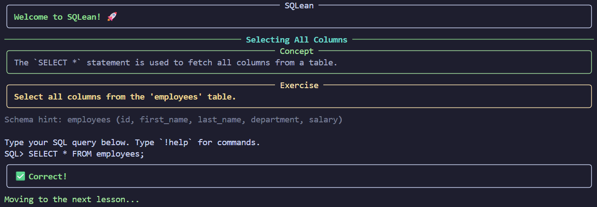
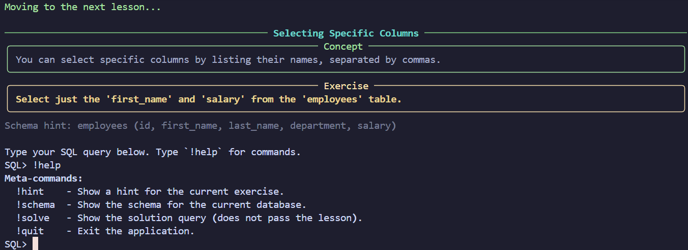

# SQLean 🚀
A simple python application that helps you learn SQL right from your command line interface.

## Screenshots




## Getting Started
- Requirements 
  - ```python: 3.13.3```

- Installation
  - ```pip install -r requirments.txt```

- Running
  - ```python main.py```


## Extending SQLean

SQLean is architected with modularity at its core, making it a highly flexible platform for SQL education. Whether you want to refine a specific lesson, design a comprehensive new module covering advanced topics, or simulate a unique industry scenario with a custom dataset, the system accommodates these changes seamlessly. This design allows educators and developers to tailor the learning experience to specific needs without altering the core application logic.

### 📂 Project Structure

Understanding the file organization is key to extending the platform:

`content/:` This directory houses all the educational material and logic flow.

`manifest.yml:` Acts as the master "Table of Contents" for the course, controlling the order and visibility of modules.

`*.yml:` These are the individual lesson modules (e.g., 01_select.yml), containing the specific exercises, hints, and solutions.

`datasets/:` This directory contains the definitions for the sandboxed environments.

`[dataset_name]/:` A dedicated folder for a specific database context (e.g., music_store_db).

`schema.sql:` Contains the DDL (Data Definition Language) to create tables and relationships.

`data.sql:` Contains the DML (Data Manipulation Language) to populate the tables with initial mock data.

### 📝 Adding New Lessons
Lessons are defined in human-readable YAML files located in the content/ directory. You can structure these files to group related concepts together.

#### Create or Edit a Module File
You have two options for adding content:

Extend an existing module: Add a new lesson entry to a file like `01_select.yml` if the topic fits the existing theme.

Create a new module: Create a new file (e.g., `04_advanced_aggregates.yml`) if you are introducing a distinct set of concepts.

#### Lesson Format

Each lesson entry requires specific fields to guide the user and validate their input. Ensure every lesson has a unique id within its module file.
```
id: 1
title: "Lesson Title"
text: "A clear, concise explanation of the SQL concept being taught."
exercise: "Specific instructions for what the user needs to query."
hint: "A helpful tip to nudge the user if they get stuck (e.g., syntax reminders)."
schema_snippet: "table_name (col1, col2)"
```
  
#### Validation Logic
```
validation_type: "results_match" # Options: results_match, keyword_check, state_check
solution_query: "SELECT * FROM table;"
```


#### Validation Types
The validator is robust and supports different teaching goals. Choose the type that best fits the exercise:

|Type|Description|Required Fields|
|-|-|-|
|results_match|The standard validation method for SELECT queries. It runs both the user's query and the solution_query, then compares the returned data. Note that row order is ignored to allow for flexibility unless an ORDER BY is specifically required.|solution_query|
|keyword_check|Useful when you want to enforce a specific syntax (e.g., teaching LEFT JOIN vs. INNER JOIN). It first verifies that specific keywords exist in the user's query string before running the standard result comparison.|required_keywords (list), solution_query|
|state_check|Essential for DML operations like UPDATE, INSERT, or DELETE where there is no output to compare. It runs the user's query first, then runs a separate validation_query to inspect the database state and ensure the changes were applied correctly.|solution_query, validation_query, expected_results (list of lists)|

### 💽 Adding New Databases

You can create custom scenarios—such as a library system, a logistics tracker, or a spaceship inventory—by adding new datasets. This allows learners to practice SQL in varied contexts.

Create a Folder: Create a new, uniquely named folder in `datasets/` (e.g., datasets/library_db/).

Create schema.sql: Add `CREATE TABLE` statements here. This defines the structure of your sandbox.

Create data.sql: Add `INSERT INTO` statements here. This provides the initial data users will query against.

>Important Note: The application is stateless. The database is rebuilt in memory from these two files every time a user runs a query. This ensures a clean state for every attempt, preventing previous errors (like accidentally deleting a table) from blocking progress.

🔗 Registering New Content

Simply creating the files is not enough; you must register them to make them accessible in the CLI. To make your new module or dataset visible, add an entry to content/manifest.yml. The order of entries here determines the order they appear to the user.

```yml
modules:
  -  id: "03_new_module"         # A unique  identifier for the module
    title: "Advanced Concepts"  # The display title in the CLI
    file: "04_advanced.yml"     # The filename you created in content/
    dataset: "library_db"       # The folder name in datasets/ that this module uses
```